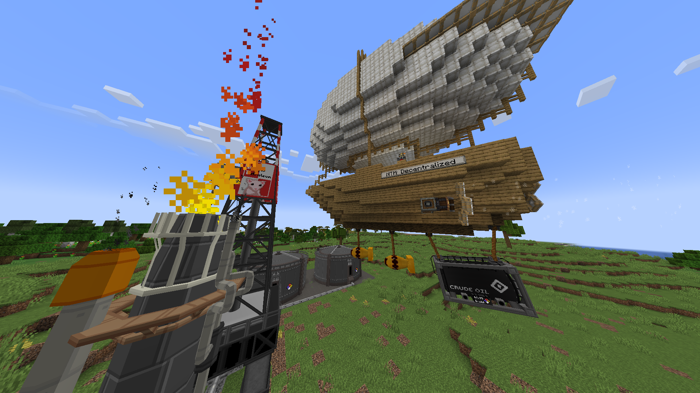

<div align="center">

# ☢️ NTM: Decentralized Edition

**HBM's Nuclear Tech Mod for Minecraft 1.21.1 — reactors, nukes, radiation, heavy industry, and all of it working on Create: Aeronautics physics contraptions.**

[](https://www.minecraft.net)
[](https://neoforged.net)
[](LICENSE.LESSER)


[](https://www.curseforge.com/minecraft/mc-mods/ntm-decentralized-edition)
[](https://modrinth.com/mod/ntm-de)
[](https://discord.gg/9TV4mHG9yD)

</div>

---

A port of the legendary **[HBM's Nuclear Tech Mod](https://github.com/HbmMods/Hbm-s-Nuclear-Tech-GIT)** from Minecraft 1.7.10 —
in fact a **backport of [NTM: NEXT](https://github.com/Warfactory-Official/ntm-next)** from Minecraft 26.2 to 1.21.1.

<p align="center">
  
  <br>
  <i>Decentralized logistics.</i>
</p>

## ✨ Highlights

- **The whole mod.** Every machine, reactor, weapon, bomb, structure and system of NTM: NEXT — RBMK, ZIRNOX, PWR,
  fusion, particle accelerator, oil and chemistry, energy and fluid networks, missiles, nukes, radiation and fallout.
- **Create: Aeronautics / Sable support.** Machines, cables, pipes and multiblocks keep working on physics
  contraptions: GUIs open and sync, networks survive assembly and disassembly, multiblocks move as a whole.
  Missiles launch from contraptions, the NTM radar tracks them, and anti-ballistic missiles can shoot them down.
- **Integrations** with the popular 1.21.1 mods — recipe viewers, info overlays, ComputerCraft, backpacks,
  performance mods (see [Compatibility](#-compatibility)).
- **Complete Russian and Ukrainian translations.**
- **In-game Ponder guides** *(work in progress)* — animated scenes explaining machines, the way Create does it.

## 📦 Installation

1. Install **Minecraft 1.21.1** with **[NeoForge](https://neoforged.net) 21.1.x**.
2. Download the mod from **[CurseForge](https://www.curseforge.com/minecraft/mc-mods/ntm-decentralized-edition)**,
   **[Modrinth](https://modrinth.com/mod/ntm-de)** (under review) or
   **[GitHub Releases](https://github.com/SecretAgent12/NTM-Decentralized-Edition/releases)**.
3. Drop `ntm-decentralized-neoforge-1.21.1-<version>.jar` into your `mods` folder.

That's it — **Flywheel** and **Ponder** are bundled inside the jar.

> [!WARNING]
> This is a **beta**: the whole mod is in and stable, but it hasn't been through many worlds and modpacks yet.
> Keep backups, and please report what breaks.

Optional: the JVM argument `--add-modules=jdk.incubator.vector` enables the SIMD code paths for radiation and noise.
Without it the mod falls back to plain Java.

## 🧩 Compatibility

| Mod | Status | Notes |
|---|:---:|---|
| Create: Aeronautics / Sable | ✅ | Machines, networks, GUIs and multiblocks on moving sub-levels |
| JEI | ✅ | All NTM recipe types |
| Jade | ✅ | Energy, fluids; multiblock parts show their core |
| The One Probe | ✅ | Energy, fluids; multiblock parts show their core |
| CC: Tweaked | ✅ | Peripherals for reactors, turbines, launch pads, storage and more |
| Curios | ✅ | Hazards of items worn in Curios slots |
| Sophisticated Storage / Backpacks | ✅ | Radiation of stored items |
| Traveler's Backpack | ✅ | Radiation of carried items (fluid tanks are not counted yet) |
| Sodium | ✅ | 0.8.x |
| Lithium | ✅ | |
| ImmediatelyFast, Gnetum | ✅ | From 1.0.0-beta.4 (older versions: dark machine GUIs) |
| ScalableLux | ✅ | Recommended (0.3.x) — relights nuke craters much faster; can't be used together with Sable |
| Iris / shaders | ❌ | Planned |
| REI, Compact Storage | ❌ | Not planned for now |
| WTHIT, Trinkets | ❌ | No NeoForge 1.21.1 builds exist |

Details and tips: [docs/compatibility.md](docs/compatibility.md). All documentation: [docs](docs/README.md).

## 🐞 Reporting bugs

Open an issue **[here](https://github.com/SecretAgent12/NTM-Decentralized-Edition/issues)** and attach:

- `logs/latest.log` (or the crash report from `crash-reports/`),
- steps to reproduce,
- your mod list.

Or ask in the **[Discord](https://discord.gg/9TV4mHG9yD)**.

> [!IMPORTANT]
> Please **don't report bugs of this build to NTM: NEXT or to HbmMods.** Many bugs here come from the backport itself;
> I sort them out and forward the ones that really belong upstream.

## ❓ FAQ

**How is this different from NTM: NEXT?**
Same mod, same content. NTM: NEXT targets Minecraft 26.2; this build runs on 1.21.1 and adds Create: Aeronautics
support and 1.21.1 mod integrations.

**Will it follow NTM: NEXT updates?**
For now, yes — upstream changes are pulled in regularly. Over time the port will also grow its own features and
integrations.

**Can I use it with Create?**
Yes. It bundles the same Flywheel and Ponder that Create 6 uses, and it is tested together with Create: Aeronautics.

**Can I use it on a server?**
Yes — install it on the server and on every client.

**Why "Decentralized Edition"?**
Because someone once said NTM needs a decentralized edition. So here it is.

## 🔨 Building from source

Requires **JDK 21**.

```sh
./gradlew build        # the jar lands in build/libs/
./gradlew runClient    # development client
```

<details>
<summary><b>How the backport works</b></summary>

<br>

The 1.21.1 source tree is rebuilt from the untouched NTM: NEXT sources by a pipeline of mechanical passes (class renames,
compatibility shims for 26.x APIs, call-site rewrites, resource format conversion), plus hand-written overrides where a
mechanical conversion is not enough. New upstream commits are merged with a three-way merge over the pipeline's output,
so the hand-written work survives every update.

More in [How the backport works](docs/how-it-works.md). Every deliberate deviation from NTM: NEXT is marked with a
`// backport:` comment in the code, and the player-visible ones are listed in [Differences from NTM: NEXT](docs/differences.md).

</details>

## 🌱 Based on

- **Original Nuclear Tech Mod** by HbmMods — <https://github.com/HbmMods/Hbm-s-Nuclear-Tech-GIT>
- **NTM: NEXT** port by Warfactory — <https://github.com/Warfactory-Official/ntm-next>

## 📬 Contacts

- Discord: <https://discord.gg/9TV4mHG9yD>
- CurseForge: <https://www.curseforge.com/minecraft/mc-mods/ntm-decentralized-edition>
- Modrinth: <https://modrinth.com/mod/ntm-de> (under review)

## 📜 Credits & License

- **HbmMods (The Bobcat)** and contributors — the original Hbm's Nuclear Tech Mod
- **movblock** and **Warfactory** — NTM: NEXT, the 26.2 port this build is based on
- **SecretAgent12** — the 1.21.1 backport, Create: Aeronautics support, integrations
- Raw ore textures: **MrNorwood** (thorium, cobalt, lithium, schrabidium); **Mr. Morgan** and **NuclearGrandFather**
  (aluminium, beryllium, lead, plutonium, titanium, tungsten, uranium)

The mod is licensed under the **[GNU LGPL-3.0](LICENSE.LESSER)**, like NTM: NEXT and the original mod. Some parts come
from other projects and keep their own licenses:

- `com.hbm.lib.neotransfer` — derived from NeoForge (the 26.2 transfer API), **LGPL-2.1**
- `com.hbm.lib.crankshaft` — derived from CrankShaft (movblock's Flywheel port) and Flywheel, **MIT**

See [`NOTICE.md`](NOTICE.md) and [`THIRD_PARTY_NOTICES`](THIRD_PARTY_NOTICES) for details.

This is an unofficial build, not affiliated with or endorsed by HbmMods or Warfactory.
